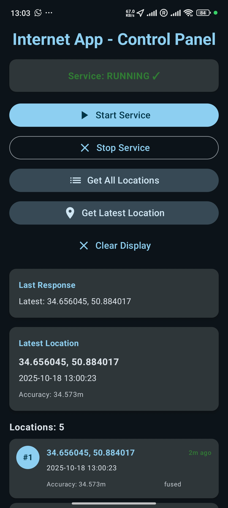
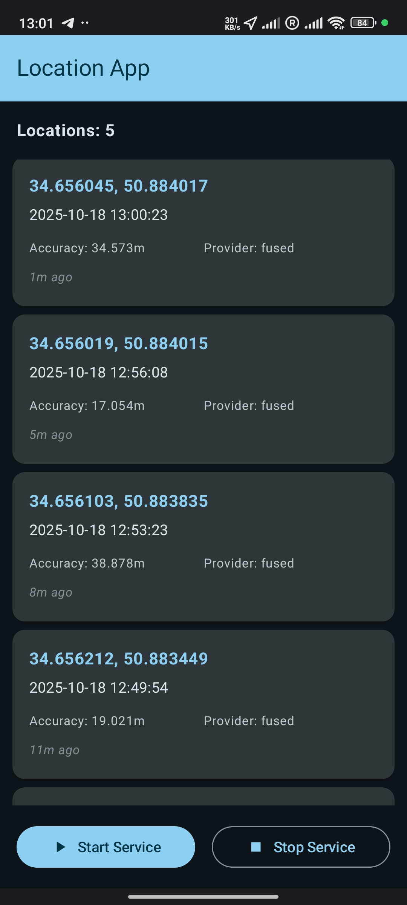

# Android Code Challenge Inter-App Communication System

|                                      Internet App                                       |                                      Location App                                       |
|:---------------------------------------------------------------------------------------:|:---------------------------------------------------------------------------------------:|
|  |  |

## Table of Contents
1. [Architecture Overview](#architecture-overview)
2. [Project Structure](#project-structure)
3. [Technology Stack](#technology-stack)
4. [Inter-App Communication Strategy](#inter-app-communication-strategy)
5. [Security Implementation](#security-implementation)

---

## Architecture Overview

### System Design
```
┌─────────────────┐         Commands/Queries        ┌─────────────────┐
│   Internet App  │ ────────────────────────────────> │  Location App   │
│   (MVI/Koin)    │                                   │  (MVVM/Hilt)    │
│                 │ <──────────────────────────────── │                 │
└─────────────────┘      Responses/Updates          └─────────────────┘
         │                                                      │
         │                                                      │
         ▼                                                      ▼
  UI State Display                               Background Location Service
                                                 + Encrypted Data Storage
```

### This project consists of two Android applications that communicate securely:

**Internet App (MVI + Koin):**
- Sends commands to Location App (start/stop service, retrieve locations)
- Receives and displays responses
- Implements MVI architecture for predictable state management
- Provides compose UI for all operations

**Location App (MVVM + Hilt):**
- Collects user location every 2-3 minute in the background
- Stores location data with AES-256-GCM encryption using Android KeyStore
- Provides secure ContentProvider interface for external commands
- Auto-restarts after process termination
- Displays collected locations in a compose UI

---

## Project Structure

```
AndroidcodeChallengeInterApp/
├── .github/
│   └── workflows/
│       └── ci.yml
│
├── config/
│   └── detekt/
│       └── detekt.yml
│
├── internet-app/
│   ├── app/
│   │   ├── src/main/
│   │   │   ├── kotlin/dev/internetapp/
│   │   │   │   └── InternetApp.kt
│   │   │   ├── AndroidManifest.xml
│   │   │   └── res/
│   │   └── src/androidTest/
│   │       └── java/dev/internetapp/presentation/
│   │           └── InterAppCommunicationTest.kt
│   │
│   ├── core/
│   │   └── common/
│   │       └── src/main/kotlin/dev/internetapp/core/common/di/
│   │           └── CommonModule.kt
│   │
│   └── feature/
│       ├── command-sender/
│       │   ├── src/main/kotlin/dev/internetapp/feature/commandsender/
│       │   │   ├── data/repository/
│       │   │   │   └── CommandRepositoryImpl.kt
│       │   │   ├── domain/
│       │   │   │   ├── repository/
│       │   │   │   │   └── CommandRepository.kt
│       │   │   │   └── usecase/
│       │   │   │       ├── GetAllLocationsUseCase.kt
│       │   │   │       ├── GetLatestLocationUseCase.kt
│       │   │   │       ├── StartServiceUseCase.kt
│       │   │   │       └── StopServiceUseCase.kt
│       │   │   └── di/
│       │   │       └── CommandSenderModule.kt
│       │   └── build.gradle.kts
│       │
│       └── response-display/
│           ├── src/main/kotlin/dev/internetapp/feature/responsedisplay/
│           │   ├── domain/model/
│           │   │   ├── CommandEffect.kt
│           │   │   ├── CommandIntent.kt
│           │   │   ├── CommandUiState.kt
│           │   │   └── ServiceStatus.kt
│           │   ├── presentation/
│           │   │   ├── components/
│           │   │   │   ├── ControlButtons.kt
│           │   │   │   ├── InfoCards.kt
│           │   │   │   ├── LocationsList.kt
│           │   │   │   ├── ResponseCards.kt
│           │   │   │   └── ServiceStatusCard.kt
│           │   │   ├── di/
│           │   │   │   └── ResponseDisplayModule.kt
│           │   │   ├── ui/theme/
│           │   │   │   └── Theme.kt
│           │   │   ├── viewmodel/
│           │   │   │   └── CommandViewModel.kt
│           │   │   └── MainActivity.kt
│           ├── src/test/kotlin/
│           │   └── dev/internetapp/feature/responsedisplay/
│           │       └── CommandViewModelTest.kt
│           └── build.gradle.kts
│
│
├── location-app/
│   ├── app/
│   │   ├── src/main/
│   │   │   ├── kotlin/dev/locationapp/
│   │   │   │   └── LocationApp.kt
│   │   │   ├── AndroidManifest.xml
│   │   │   └── res/
│   │   └── build.gradle.kts
│   │
│   ├── core/
│   │   ├── common/
│   │   │   ├── src/main/kotlin/dev/locationapp/di/
│   │   │   │   └── AppModule.kt
│   │   │   └── build.gradle.kts
│   │   │
│   │   ├── database/
│   │   │   ├── src/main/kotlin/dev/locationapp/di/
│   │   │   │   └── DatabaseModule.kt
│   │   │   └── build.gradle.kts
│   │   │
│   │   └── security/
│   │       ├── src/main/kotlin/dev/locationapp/core/security/
│   │       │   ├── data/
│   │       │   │   └── CryptoManager.kt
│   │       │   ├── di/
│   │       │   │   └── SecurityModule.kt
│   │       │   └── domain/
│   │       │       ├── EncryptedData.kt
│   │       │       └── ICryptoManager.kt
│   │       ├── src/test/kotlin/
│   │       │   └── dev/locationapp/core/security/
│   │       │       ├── data/
│   │       │       │   └── CryptoManagerTest.kt
│   │       │       └── domain/
│   │       │           └── FakeCryptoManager.kt
│   │       └── build.gradle.kts
│   │
│   └── feature/
│       ├── command/
│       │   ├── src/main/
│       │   │   ├── kotlin/dev/locationapp/feature/command/
│       │   │   │   ├── data/handler/
│       │   │   │   │   └── CommandHandlers.kt
│       │   │   │   ├── presentation/provider/
│       │   │   │   │   └── LocationCommandProvider.kt
│       │   │   │   └── di/
│       │   │   │       └── CommandFeatureModule.kt
│       │   │   ├── AndroidManifest.xml
│       │   │   └── res/
│       │   └── build.gradle.kts
│       │
│       └── location/
│           ├── src/main/
│           │   ├── kotlin/dev/locationapp/feature/location/
│           │   │   ├── data/
│           │   │   │   ├── local/
│           │   │   │   │   ├── LocationDao.kt
│           │   │   │   │   ├── LocationDatabase.kt
│           │   │   │   │   └── LocationEntity.kt
│           │   │   │   └── repository/
│           │   │   │       └── LocationRepositoryImpl.kt
│           │   │   ├── domain/
│           │   │   │   ├── repository/
│           │   │   │   │   └── LocationRepository.kt
│           │   │   │   └── usecase/
│           │   │   │       ├── GetAllLocationsUseCase.kt
│           │   │   │       ├── GetLatestLocationUseCase.kt
│           │   │   │       └── SaveLocationUseCase.kt
│           │   │   ├── presentation/
│           │   │   │   ├── components/
│           │   │   │   │   └── LocationScreenComponents.kt
│           │   │   │   ├── ui/theme/
│           │   │   │   │   └── Theme.kt
│           │   │   │   ├── LocationListState.kt
│           │   │   │   ├── LocationListViewModel.kt
│           │   │   │   └── MainActivity.kt
│           │   │   ├── service/
│           │   │   │   ├── BootReceiver.kt
│           │   │   │   └── LocationCollectionService.kt
│           │   │   └── di/
│           │   │       └── LocationFeatureModule.kt
│           │   └── AndroidManifest.xml
│           ├── src/test/kotlin/
│           │   └── dev/locationapp/feature/location/
│           │       ├── data/repository/
│           │       │   └── LocationRepositoryImplTest.kt
│           │       ├── di/
│           │       │   └── TestDatabaseModule.kt
│           │       └── service/
│           │           └── LocationCollectionServiceTest.kt
│           └── build.gradle.kts
│
├── protocol/
│   ├── src/main/kotlin/dev/abbasian/protocol/
│   │   ├── domain/
│   │   │   ├── model/
│   │   │   │   ├── LocationCommand.kt
│   │   │   │   ├── LocationData.kt
│   │   │   │   └── LocationResponse.kt
│   │   │   └── logger/
│   │   │       └── AppLogger.kt
│   │   └── data/
│   │       └── constants/
│   │           └── ProtocolConstants.kt
│   └── build.gradle.kts
│
├── settings.gradle.kts
└── README.md
```

---

## Technology Stack

### Internet App
- **Language**: Kotlin
- **DI**: Koin
- **Architecture**: MVI + Clean Architecture
- **Async**: Coroutines + Flow
- **State Management**: StateFlow + sealed classes
- **Communication**: ContentProvider or Messenger Service

### Location App
- **Language**: Kotlin
- **DI**: Hilt
- **Architecture**: MVVM + Clean Architecture
- **Async**: Coroutines + Flow
- **Database**: Room with SQLCipher
- **Background**: WorkManager + Foreground Service
- **Location**: FusedLocationProviderClient
- **Security**: Android KeyStore + AES-256-GCM

### Shared Components
- **Logger**: Timber with custom tree
- **Protocol**: Sealed classes for commands/responses

---

## Inter-App Communication Strategy

**Why did I choose this implementation?**
1. ✅ Secure - Can restrict access via permissions
2. ✅ Reliable - System-managed lifecycle
3. ✅ Bidirectional - Supports both queries and callbacks
4. ✅ Testable - Can mock ContentResolver
5. ✅ Battery-efficient - No persistent connections

### Communication Flow

```kotlin
// command Types in shared protocol
sealed class LocationCommand {
    object StartService : LocationCommand()
    object StopService : LocationCommand()
    object GetAllLocations : LocationCommand()
    object GetLatestLocation : LocationCommand()
}

sealed class LocationResponse {
    data class Success(val message: String) : LocationResponse()
    data class LocationList(val locations: List<LocationData>) : LocationResponse()
    data class SingleLocation(val location: LocationData?) : LocationResponse()
    data class Error(val message: String, val code: ErrorCode) : LocationResponse()
}
```

### Implementation Components

**Location App - Provider:**
```kotlin
class LocationCommandProvider : ContentProvider() {
    
    override fun call(method: String, arg: String?, extras: Bundle?): Bundle? {
        // for call commands and return encrypted responses
    }
}
```

**Internet App - Client:**
```kotlin
class CommandRepositoryImpl(): CommandRepository {
    private val contentResolver: ContentResolver = context.contentResolver
    
    override suspend fun sendCommand(command: LocationCommand): LocationResponse {
        // send command via contentResolver.call()
    }
}
```

---

## Security Implementation

### 1. Data Encryption (Location App)

```kotlin
class CryptoManager @Inject constructor() {

    private val keyStore =
        KeyStore.getInstance(KEYSTORE_PROVIDER).apply {
            load(null)
        }

    private fun getOrCreateKey(): SecretKey {
        if (!keyStore.containsAlias(KEY_ALIAS)) {
            createKey()
        }
        return keyStore.getKey(KEY_ALIAS, null) as SecretKey
    }

    override fun encrypt(plainText: String): EncryptedData {
        val cipher = Cipher.getInstance(TRANSFORMATION)
        cipher.init(Cipher.ENCRYPT_MODE, getOrCreateKey())
        val iv = cipher.iv
        val encrypted = cipher.doFinal(plainText.toByteArray(Charsets.UTF_8))
        return EncryptedData(encrypted, iv)
    }

    override fun decrypt(encryptedData: EncryptedData): String {
        val cipher = Cipher.getInstance(TRANSFORMATION)
        val spec = GCMParameterSpec(GCM_TAG_LENGTH, encryptedData.iv)
        cipher.init(Cipher.DECRYPT_MODE, getOrCreateKey(), spec)
        val decrypted = cipher.doFinal(encryptedData.data)
        return String(decrypted, Charsets.UTF_8)
    }
    
    companion object {
        private const val KEYSTORE_PROVIDER = "AndroidKeyStore"
        private const val TRANSFORMATION = "AES/GCM/NoPadding"
    }
}
```

### 2. Inter-App Communication Security

```xml
<provider
    android:name="dev.locationapp.feature.command.presentation.provider.LocationCommandProvider"
    android:authorities="dev.locationapp.provider"
    android:enabled="true"
    android:exported="true"
    android:grantUriPermissions="true"
    android:permission="dev.locationapp.permission.ACCESS_LOCATION_COMMANDS"
    android:readPermission="dev.locationapp.permission.ACCESS_LOCATION_COMMANDS"
    android:writePermission="dev.locationapp.permission.ACCESS_LOCATION_COMMANDS"
    android:multiprocess="false" />

<permission
    android:name="dev.locationapp.permission.ACCESS_LOCATION_COMMANDS"
    android:protectionLevel="signature"
    android:description="@string/permission_description"
    android:label="@string/permission_label" />
```

---

## Testing Strategy

### Internet App Tests
```kotlin
class InterAppCommunicationTest {

    @Test
    fun `sendStartServiceCommandAndReceiveSuccessResponse`()

    @Test
    fun `sendGetLocationsCommandReturnsLocationList`()
}

class CommandViewModelTest {
    
    @Test
    fun `start service intent updates state to running`()

    @Test
    fun `stop service intent updates state to stopped`()

    @Test
    fun `get all locations intent updates locations list`()

    @Test
    fun `error response updates error state`()

    @Test
    fun `effect emits success on start service`()
}
```

### Location App Tests
```kotlin
class LocationRepositoryImplTest {
    
    @Test
    fun `saveLocation encrypts and stores location`()

    @Test
    fun `getAllLocations decrypts and returns locations`()

    @Test
    fun `getLatestLocation returns null when no data`()
}

@HiltAndroidTest
class LocationCollectionServiceTest {

    @Test
    fun `service starts successfully`()

    @Test
    fun `onCreate creates notification channel`()

    @Test
    fun `onStartCommand with no action starts collection`()

    @Test
    fun `onStartCommand with ACTION_START_COLLECTION starts collection`()

    @Test
    fun `onStartCommand with ACTION_STOP_COLLECTION stops collection`()

    @Test
    fun `stopLocationCollection stops service`()

    @Test
    fun `onBind returns null`()

    @Test
    fun `service without location permission stops itself`()

    @Test
    fun `service lifecycle completes successfully`()

    @Test
    fun `onDestroy cleans up resources`()

    @Test
    fun `starting collection twice logs warning`()

    @Test
    fun `stopping collection when not running logs warning`()

    @Test
    fun `notification has correct properties`()

    @Test
    fun `service constants are correct`()
}
```

---

## Part of Criteria

✅ Both apps compile and run without errors  
✅ Location collected every 2-3 minute in background  
✅ Service survives reboot and system kills  
✅ Data encrypted with KeyStore  
✅ Commands sent and responses received reliably  
✅ 80%+ test coverage  
✅ CI/CD pipeline runs successfully  
✅ Clean Architecture properly implemented  
✅ Comprehensive documentation provided  
✅ Git Flow followed with clear commits
✅ Error handling and recovery logic
✅ Analytics and performance monitoring

---